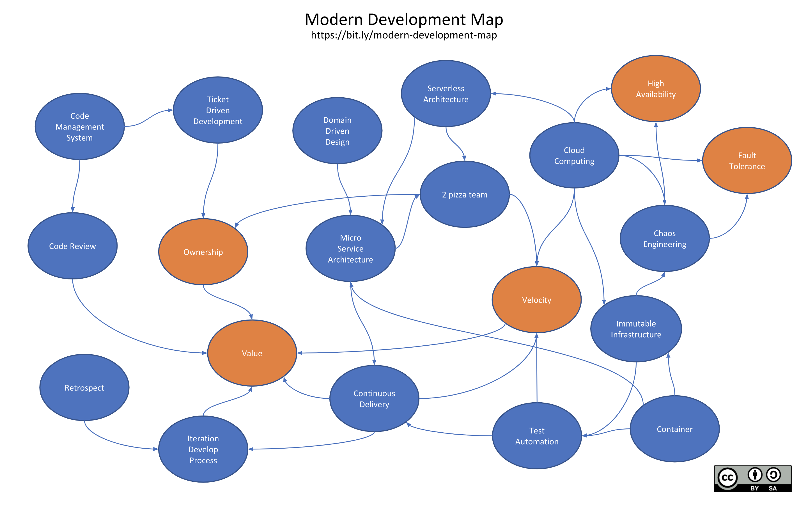

# 모던-한 개발자 되기

picture by [serithemage](https://github.com/serithemage)

> 위 그림을 참고하여, 보고 들은 개념과 제 생각을 종합하여 정리했습니다. 아래 내용은 정답이 아닙니다.

- Ownership: 외주 개발이나, 인하우스 개발과 달리 자기가 개발한 서비스에 대한 운영 주체가 된다.

- Value: 개발자가 작성한 프로젝트에서 가치를 창출한다.

- Velocity: 경쟁사보다 더 빠르게 가치를 창출해 경쟁에서 이겨내야 한다.

- Ticket Driven Development: 무작위의 개발이 아닌 모든 커밋은 티켓(이슈)를 통해 개발되고 머지된다.

- Code Management System: 무작위의 코드 개발이 아닌 추적 가능한 코드 작성을 위해 git 등의 버전관리 도구를 사용한다.

- Code Review: 모든 코드는 동료의 리뷰를 거친다. Google, Amazon 등의 큰 회사도 개발자의 여러 자유를 보장하지만 코드 리뷰에 한해서는 Mandatory이다. 이 때, 코드 리뷰는 신중하게 이루어져야한다.

  - 코드의 로직을 검사하는 것이 목적이 아니다. 테스트가 올바르게 작성되어 있고, 작성된 코드가 테스트를 통과하는 것이 중점사항이다.

  - 코드 리뷰를 통해 리뷰이와 리뷰어 모두 개발을 학습한다. 제대로 코드 리뷰가 이루어지면 둘의 실력이 상향평준화할 수 있다.

  - 리뷰는 절대적으로 코드에 이루어진다. 상대에 대한 인신공격이나, 비하는 절대 해서는 안된다.

- Iteration Develop Process: 개발 과정은 약 2주간의 스프린트로 이뤄진다.

  - 하루에 집중해서 코딩할 수 있는 시간을 4시간으로 산정한다.

  - 이슈마다 태스크를 두어 0.5시간 단위로 처리할 수 있는 업무를 태스크에 할당한다.

  - 2주 동안 사용할 수 있는 시간만큼 이슈를 할당하여 2주간 개발한다.

  - 태스크마다 정해진 시간을 사용하여 개발한다. 이 때, 만약 태스크를 끝마치지 못할 것 같다고 코드를 대충 작성하여 시간 내에 끝내려고 하지 않는다.

  - 계획이 잘못된 것이므로 태스크에 추가적인 시간을 산정하여 작업한다.

- Retrospect: 2주간의 스프린트가 끝나면 회고의 시간을 갖는다. 잘된 점, 개선하면 좋을 점, 앞으로는 하면 안될 것을 기록한다.

  - 회고록을 꼭 작성하여 다음 스프린트가 끝난 뒤 저번 스프린트와 비교해서 더 나아지도록 개선한다.

- Continuous Delivery: 이슈 단위로 머지될 때마다, 배포할 수 있도록 계획을 산정한다. 배포는 자동화한다.

- Test Automation: 테스트는 배포에 선행되어야 한다. 테스트가 실패하면 배포되지 않는다. 이를 자동화한다.

  - TDD를 위한 TDD를 지향하지 않는다. 내가 작성한 로직을 테스트하고, 테스트가 필요한 부분에 유닛 테스트를 작성하는 것이 기본이다.

- Immutable Infrastructure: 불변의 인프라를 사용한다. 한 번 배포된 프로그램을 수정해서 사용하는 것이 아니라, 소스코드가 배포되면 새로운 인프라를 배포한다.

- Container: 컨테이너를 사용하면 빌드한 프로그램을 배포하고, 새로운 빌드가 필요할 때, 기존의 컨테이너를 버리고 새로운 컨테이너를 배포한다.

- Microservice Architecure: 개발자간의 간섭이 적은 개발을 위해 마이크로서비스를 지향한다.

- Domain Driven Design: 도메인 모델을 갖는 서비스를 개발한다.

- 2 Pizza Team: 2개의 피자를 나눠먹을 수 있는 인원의 팀을 구성한다. 이 인원 이상의 팀은 커뮤니케이션에 불필요한 시간이 소요될 수 있다.

- Cloud Computing, Chaos Engineering: 고가용성, 장애 감내성을 가진 서비스를 개발하여 24/7 서비스 운영을 목표로 한다.
